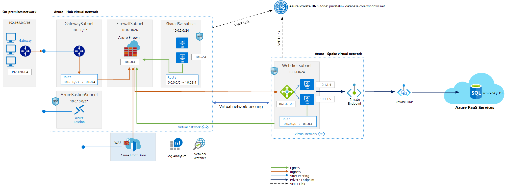
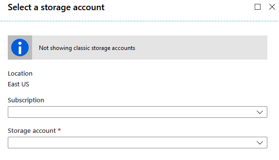
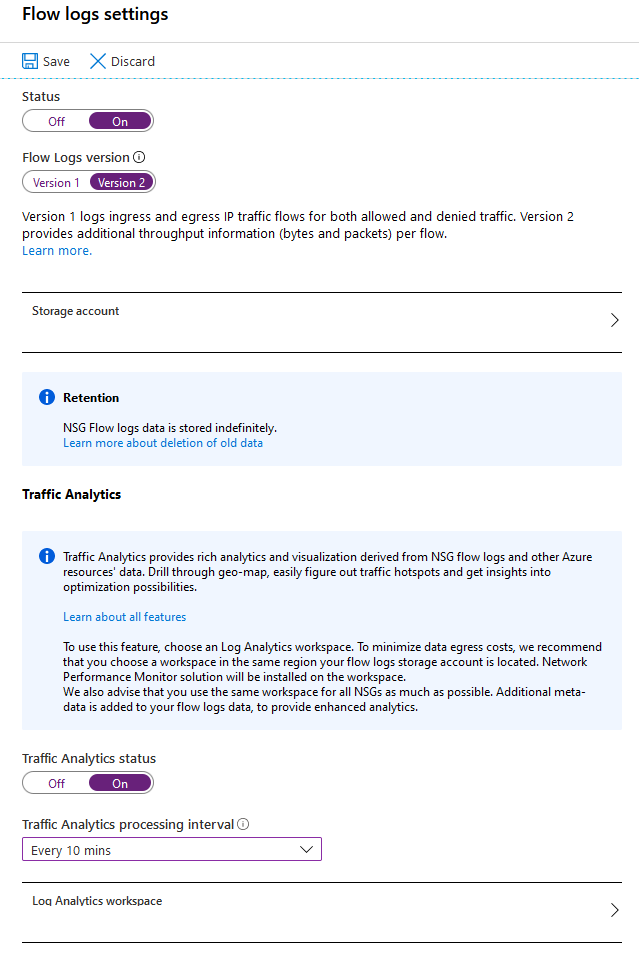
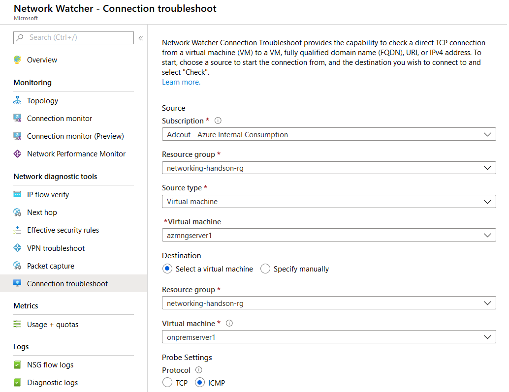
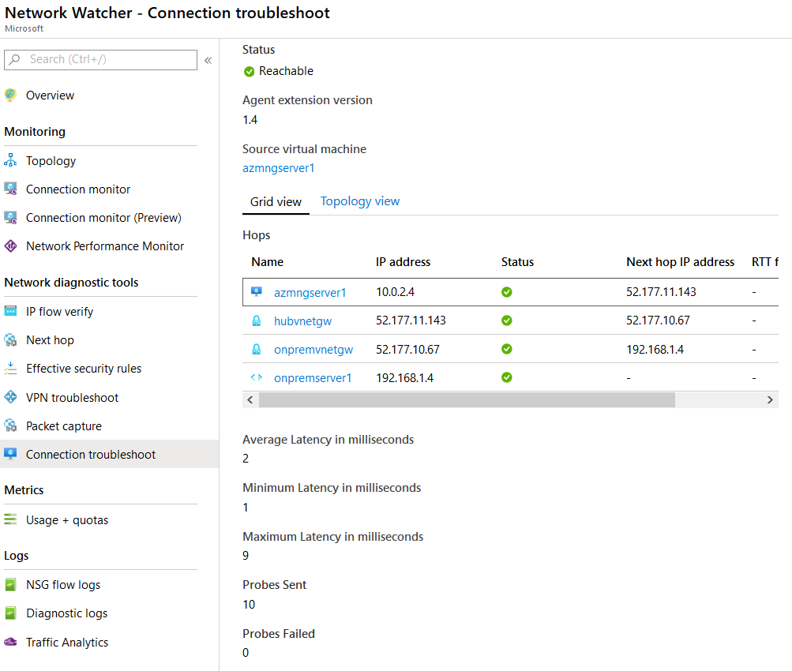

# Azure Networking hands-on lab step-by-step - Hub-Spoke Architeture

## Overview

 In this hands-on lab, you will setup a virtual networks in a hub-and-spoke design. You will also learn how to secure virtual networks by implementing Azure Firewall, network security groups and private endpoint as well as configure route tables on the subnets in your virtual network. Additionally, you will set up access to the virtual network via a azure bastion and provision a site-to-site VPN connection from another virtual network, providing emulation of hybrid connectivity from an on-premises environment.

At the end of this hands-on lab, you will be better able to configure Azure networking components and you will be learning:

- How to bypass system routing to accomplish custom routing scenarios.

- How to setup and configure a virtual network and subnets on Azure

- How to setup load balancers layer 4 ando layer 7 to distribute load and ensure service availability.

- How to deploy the azure PaaS services (Azure SQL DB) into a virtual network.

- How to implement Azure Firewall to control hybrid and cross-virtual network traffic.

- How to implement a  Network Security Groups (NSGs) to control traffic between virtual networks.

- How to monitor network traffic for proper route configuration and troubleshooting.

## Network Architecture



## Requirements

- Valid the Azure subscription account. If you don't have one, you can create your free azure account (https://azure.microsoft.com/en-us/free/).

## Exercise 1: Create a virtual network and provision subnets

Duration: 20 minutes

### Task 1: Create a Virtual Network and Configure Subnets

**Reference:**</br>
Virtual Network documentation</br>
<https://azure.microsoft.com/en-us/documentation/services/virtual-network/>  


> **More Information:** https://docs.microsoft.com/en-us/azure/virtual-network/quick-create-portal

#### Create a virtual network using the Azure Cloud Shell. (*Bash*)

> **More Information:** https://docs.microsoft.com/en-us/azure/virtual-network/quick-create-portal

1. To start Azure Cloud Shell:

- Select the Cloud Shell button on the menu bar at the upper right in the Azure portal. ->

    

2. Wait the windows apear and enter into the prompt with the following information:

```Azure CLI
** Virtual Network - HUB **
az group create --name networking-handson-rg --location eastus2
az network vnet create --resource-group networking-handson-rg --name hubvnet --location eastus2 --address-prefixes 10.0.0.0/16 --subnet-name GatewaySubnet --subnet-prefix 10.0.1.0/27
az network vnet subnet create --address-prefix 10.0.2.0/24 --name sharedsvcsubnet --resource-group networking-handson-rg --vnet-name hubvnet
az network vnet subnet create --address-prefix 10.0.8.0/26 --name AzureFirewallSubnet --resource-group networking-handson-rg --vnet-name hubvnet
az network vnet subnet create --address-prefix 10.0.10.0/27 --name AzureBastionSubnet --resource-group networking-handson-rg --vnet-name hubvnet
```

```Azure CLI
** Virtual Network - SPOKE **
az network vnet create --resource-group networking-handson-rg --name spokevnet --location eastus2 --address-prefixes 10.1.0.0/16 --subnet-name websubnet --subnet-prefix 10.1.1.0/24
```

```Azure CLI
** Virtual Network - On-premises **
az network vnet create --resource-group networking-handson-rg --name onpremvnet --location eastus2 --address-prefixes 192.168.0.0/16 --subnet-name onpremSubnet --subnet-prefix 192.168.1.0/24
```

3. Validate if **Virtual Networks** is create, run following command:

```Azure CLI
az network vnet list -g networking-handson-rg --output table
```
Now you built the Azure network enviroments: On-premises, Hub and Spoke on Azure.

## Exercise 2: Create a Virtual Machine and Azure SQL DB

Duration: 30 minutes

### Task 1: Create the Virtual Machines 

**Reference:**</br>
Virtual Machines Documentation</br>
<https://docs.microsoft.com/en-us/azure/virtual-machines/>  

#### Create a virtual machine using the Azure Cloud Shell. (*Bash*)

> **More Information:** https://docs.microsoft.com/en-us/azure/virtual-machines/windows/quick-create-cli

> **Note:** In this step you wil create 4 machines: 2 VMs for hubvnet, 1 VM for spokevnet and 1 VM for onpremisesvnet.

1. To start Azure Cloud Shell:

- Select the Cloud Shell button on the menu bar at the upper right in the Azure portal. ->

    


2. Wait the windows apear and enter into the prompt with the following information:

```Azure CLI
** Virtual Machine - Hub **
az network nic create --resource-group networking-handson-rg -n azshsvcserver1-nic --location eastus2 --subnet sharedsvcsubnet --vnet-name hubvnet --private-ip-address 10.0.2.4
az vm create -n azshsvcserver1 -g networking-handson-rg --image win2016datacenter  --storage-sku Standard_LRS --admin-username azureuser --admin-password Msft@123456@ --nics azshsvcserver1-nic --no-wait
az vm extension set --publisher Microsoft.Compute --version 1.8 --name CustomScriptExtension --vm-name azshsvcserver1 -g networking-handson-rg --settings '{"fileUris":["https://aznetworkinghandson.blob.core.windows.net/public/enable-icmp.ps1"],"commandToExecute":"powershell.exe -ExecutionPolicy Unrestricted -file enable-icmp.ps1"}' --no-wait
```

```Azure CLI
** Virtual Machine - Spoke **
az vm availability-set create -n azwsserver-avset -g networking-handson-rg --platform-fault-domain-count 2 --platform-update-domain-count 2
az network nic create --resource-group networking-handson-rg -n azwsserver1-nic --location eastus2 --subnet websubnet --vnet-name spokevnet --private-ip-address 10.1.1.4
az vm create -n azwsserver1 -g networking-handson-rg --image win2016datacenter --storage-sku Standard_LRS --admin-username azureuser --admin-password Msft@123456@ --nics azwsserver1-nic --availability-set azwsserver-avset --no-wait
az vm extension set --publisher Microsoft.Compute --version 1.8 --name CustomScriptExtension --vm-name azwsserver1 -g networking-handson-rg --settings '{"fileUris":["https://aznetworkinghandson.blob.core.windows.net/public/deploy-iis.ps1"],"commandToExecute":"powershell.exe -ExecutionPolicy Unrestricted -file deploy-iis.ps1"}' --no-wait

az network nic create --resource-group networking-handson-rg -n azwsserver2-nic --location eastus2 --subnet websubnet --vnet-name spokevnet --private-ip-address 10.1.1.5
az vm create -n azwsserver2 -g networking-handson-rg --image win2016datacenter --storage-sku Standard_LRS --admin-username azureuser --admin-password Msft@123456@ --nics azwsserver2-nic --availability-set azwsserver-avset --no-wait
az vm extension set --publisher Microsoft.Compute --version 1.8 --name CustomScriptExtension --vm-name azwsserver2 -g networking-handson-rg --settings '{"fileUris":["https://aznetworkinghandson.blob.core.windows.net/public/deploy-iis.ps1"],"commandToExecute":"powershell.exe -ExecutionPolicy Unrestricted -file deploy-iis.ps1"}' --no-wait
```

```Azure CLI
** Virtual Machine - On-premises **
az network nic create --resource-group networking-handson-rg -n onpremserver1-nic --location eastus2 --subnet onpremSubnet --vnet-name onpremvnet --private-ip-address 192.168.1.4
az vm create -n onpremserver1 -g networking-handson-rg --image win2016datacenter --storage-sku Standard_LRS --admin-username azureuser --admin-password Msft@123456@ --nics onpremserver1-nic --no-wait
az vm extension set --publisher Microsoft.Compute --version 1.8 --name CustomScriptExtension --vm-name onpremserver1 -g networking-handson-rg --settings '{"fileUris":["https://aznetworkinghandson.blob.core.windows.net/public/enable-icmp.ps1"],"commandToExecute":"powershell.exe -ExecutionPolicy Unrestricted -file enable-icmp.ps1"}' --no-wait
```

3. Validate if **Virtual Machines** is create, run following command:

``` Azure CLI
az vm list -g networking-handson-rg --output table
```

### Task 2: Create a Azure SQL DB 

1. To start Azure Cloud Shell and enter with the following information:

``` Azure CLI
az sql server create --name sqlservernethandson --resource-group networking-handson-rg --location eastus2 --admin-user azureuser --admin-password Msft@123456@
az sql db create --resource-group networking-handson-rg --server sqlservernethandson --name dbnethandson --edition GeneralPurpose --family Gen4 --capacity 1 --zone-redundant false 
```


## Exercise 3: Create a Network Monitoring Solution

Duration: 15 minutes

### Task 1: Create a Log Analytics Workspace

**Reference:**</br>
Azure Monitor documentation</br>
<https://docs.microsoft.com/en-us/azure/azure-monitor/></br>
What is Azure Network Watcher?</br>
<https://docs.microsoft.com/en-us/azure/network-watcher/network-watcher-monitoring-overview>


#### Create a Log Analytics and Network Watcher using the Azure Cloud Shell.(*Bash*)

> **More Information:** https://docs.microsoft.com/en-us/azure/virtual-machines/windows/quick-create-cli

1. To start Azure Cloud Shell:

- Select the Cloud Shell button on the menu bar at the upper right in the Azure portal. ->

    


2. Wait the windows apear and enter into the prompt with the following information:

``` Azure CLI
az monitor log-analytics workspace create -g networking-handson-rg  -n azurenetworkmonitor 
```
In workspace name **Enter Unique Name all lowercase**

3. Validate if **Log Analytics** is create, run following command:

``` Azure CLI
az monitor log-analytics workspace list -g networking-handson-rg  --output table
```

### Task 2: Configure Network Watcher

1. To start Azure Cloud Shell and enter with the following information:

``` Azure CLI
az network watcher configure -g networking-handson-rg  -l eastus2 --enabled true
```
3. Validate if **Network Watcher** is create, run following command:

``` Azure CLI
az network watcher list --output table
```
## Exercise 4: Configure Network Security Groups

In this exercise, you will restrict traffic between tiers of n-tier application by using network security groups and application security groups.

Duration: 20 minutes

**Reference:**</br>
Azure Network Security Groups</br>
<https://docs.microsoft.com/en-us/azure/virtual-network/security-overview></br>


### Task 1: Create a network security group

#### Create a Network Security Groups using the Azure Cloud Shell.(*Bash*)

> **More Information:** https://docs.microsoft.com/en-us/azure/virtual-machines/windows/quick-create-cli

1. To start Azure Cloud Shell:

- Select the Cloud Shell button on the menu bar at the upper right in the Azure portal. ->

    


2. Wait the windows apear and enter into the prompt with the following information:

``` Azure CLI
** Virtual Machine - Azure Bastion **
az network nsg create -g networking-handson-rg --name nsg_azurebastion
az network nsg rule create --name bastion-in-allow --nsg-name nsg_azurebastion --priority 100 -g networking-handson-rg --access Allow --protocol Tcp --direction Inbound --destination-port-ranges 443
az network nsg rule create --name bastion-control-in-allow --nsg-name nsg_azurebastion --priority 120 -g networking-handson-rg --access Allow --protocol Tcp --direction Inbound --destination-port-ranges 443 4443 --source-address-prefixes GatewayManager
az network nsg rule create --name bastion-in-deny --nsg-name nsg_azurebastion --priority 900 -g networking-handson-rg --access Deny --protocol Tcp --direction Inbound
az network nsg rule create --name bastion-vnet-out-allow --nsg-name nsg_azurebastion --priority 100 -g networking-handson-rg --access Allow --protocol Tcp --direction Outbound --destination-port-ranges 22 3389 --destination-address-prefixes VirtualNetwork
az network nsg rule create --name bastion-azure-out-allow --nsg-name nsg_azurebastion --priority 120 -g networking-handson-rg --access Allow --protocol Tcp --direction Outbound --destination-port-ranges 443 --destination-address-prefixes AzureCloud
az network vnet subnet update -g networking-handson-rg -n AzureBastionSubnet --vnet-name hubvnet --network-security-group nsg_azurebastion
```

``` Azure CLI
** Virtual Machine - Shared Services Subnet **
az network nsg create -g networking-handson-rg --name nsg_managment
az network nsg rule create --name managment-in-allow_ssh_rdp --nsg-name nsg_managment --priority 100 -g networking-handson-rg --access Allow --protocol Tcp --direction Inbound --destination-port-ranges 22 3389 --source-address-prefixes VirtualNetwork
az network nsg rule create --name managment-in-allow_icmp --nsg-name nsg_managment --priority 120 -g networking-handson-rg --access Allow --protocol Icmp --direction Inbound --source-address-prefixes VirtualNetwork
az network vnet subnet update -g networking-handson-rg -n sharedsvcsubnet --vnet-name hubvnet --network-security-group nsg_managment
```

``` Azure CLI
** Virtual Machine - Web Subnet **
az network nsg create -g networking-handson-rg --name nsg_web
az network nsg rule create --name web-in-allow_ssh_rdp --nsg-name nsg_web --priority 100 -g networking-handson-rg --access Allow --protocol Tcp --direction Inbound --destination-port-ranges 22 3389 --destination-address-prefixes VirtualNetwork
az network nsg rule create --name web-in-allow_https_http --nsg-name nsg_web --priority 120 -g networking-handson-rg --access Allow --protocol Tcp --direction Inbound --destination-port-ranges 443 80 --destination-address-prefixes VirtualNetwork
az network nsg rule create --name web-in-allow_icmp --nsg-name nsg_web --priority 130 -g networking-handson-rg --access Allow --protocol Icmp --direction Inbound --source-address-prefixes VirtualNetwork
az network vnet subnet update -g networking-handson-rg -n websubnet --vnet-name spokevnet --network-security-group nsg_web
```

3. Validate if **Network Security Group** is create, run following command:

``` Azure CLI
az network nsg list -g networking-handson-rg --output table
```

## Exercise 5: Configure Azure Bastion Host

In this exercise, you will create and configure an Azure Bastion host. Once you provision the Azure Bastion service in your virtual network, the seamless RDP/SSH experience is available to all of the VMs in the same virtual network. Azure Bastion deployment is per virtual network.

Duration: 15 minutes

**Reference:**</br>
Azure Bastion documentation</br>
<https://docs.microsoft.com/en-us/azure/bastion/></br>


### Task 1: Create Azure Bastion Host

#### Create an Azure Bastion Hosts using the Azure Cloud Shell. (*Bash*)

> **More Information:** https://docs.microsoft.com/en-us/azure/bastion/bastion-create-host-powershell

1. To start Azure Cloud Shell:

- Select the Cloud Shell button on the menu bar at the upper right in the Azure portal. ->

    


2. Wait the windows apear and enter into the prompt with the following information:

``` Azure CLI
az network public-ip create -g networking-handson-rg -n azurebastionhub-pip --location eastus2 --allocation-method Static --sku Standard
az network bastion create --name azurebastionhub --public-ip-address azurebastionhub-pip --resource-group networking-handson-rg --vnet-name hubvnet --location eastus2
```
After that wait 5 minutes for bastion resoruce to create and deploy.

3. Open the **Azure portal**. Navigate to the virtual machine that you want to connect to, then click Connect. The VM should be a Windows virtual machine when using an RDP connection.


4. After you click Connect, a side bar appears that has three tabs – RDP, SSH, and Bastion. If Bastion was provisioned for the virtual network, the Bastion tab is active by default. If you didn't provision Bastion for the virtual network, you can click the link to configure Bastion


5. Connect a Azure Bastion to **azshsvcserver1** virtual machine and sign in. On **azshsvcserver1**, open the command prompt and run *ping -t 10.1.1.4* **(azwsserver1)**. The ping should fail.

## Exercise 6: Configure Virtual Network Peering

In this exercise, you will create and configure a Virtual Network peering between hubvnet and spokevnet. These virtual networks can be in the same region or different regions (also known as Global VNet peering). Once virtual networks are peered, resources in both virtual networks are able to communicate with each other, with the same latency and bandwidth as if the resources were in the same virtual network.

Duration: 15 minutes

**Reference:**</br>
Virtual network peering</br>
<https://docs.microsoft.com/en-us/azure/virtual-network/virtual-network-peering-overview></br>

### Task 1: Create Virtual Network Peering

#### Create a Virtual Network Peering using the Azure Cloud Shell. (*Bash*)

> **More Information:** https://docs.microsoft.com/en-us/azure/bastion/bastion-create-host-powershell

1. To start Azure Cloud Shell:

- Select the Cloud Shell button on the menu bar at the upper right in the Azure portal. ->

    


2. Wait the windows apear and enter into the prompt with the following information:

``` Azure CLI
hubvNet1Id=$(az network vnet show --resource-group networking-handson-rg --name hubvnet --query id --out tsv)
spokevNet1Id=$(az network vnet show --resource-group networking-handson-rg --name spokevnet --query id --out tsv)
az network vnet peering create --name hubvnet-to-spokevnet --resource-group networking-handson-rg --vnet-name hubvnet --remote-vnet $spokevNet1Id --allow-vnet-access 
az network vnet peering create --name spokevnet-to-hubvnet --resource-group networking-handson-rg --vnet-name spokevnet --remote-vnet $hubvNet1Id --allow-vnet-access 
```
3. You created a peering from hubvnet to spokehub on both side. Resources in one virtual network cannot communicate with resources in the other virtual network until the **peeringState** for the peerings in both virtual networks is *Connected*. Validate it with following command.

``` Azure CLI
az network vnet peering show --name hubvnet-to-spokevnet --resource-group networking-handson-rg --vnet-name hubvnet --query peeringState
```

Connect again in Azure Bastion to **azshsvcserver1** virtual machine and sign in. On **azshsvcserver1**, open the command prompt and run *ping -t 10.1.1.4* **(azwsserver1)**. The ping works.

## Exercise 7: Create route tables with definition routes

Route Tables are containers for User Defined Routes (UDRs). The route table is created and associated with a subnet. UDRs allow you to direct traffic in ways other than normal system routes would. In this case, UDRs will direct outbound traffic via the Azure firewall.

Duration: 20 minutes

**Reference:**</br>
Virtual network traffic routing</br>
<https://docs.microsoft.com/en-us/azure/virtual-network/virtual-networks-udr-overview/></br>

### Task 1: Create and configure Route Table

#### Create and Configure a Route Table using the Azure Cloud Shell. (*Bash*)

> **More Information:** https://docs.microsoft.com/en-us/azure/firewall/deploy-cli

1. To start Azure Cloud Shell:

- Select the Cloud Shell button on the menu bar at the upper right in the Azure portal. ->

    


2. Wait the windows apear and enter into the prompt with the following information:

``` Azure CLI
az network route-table create --name route-hubvnet-sharedsvcsubnet --resource-group networking-handson-rg
az network route-table route create --name hubvnet-sharedsvcsubnet-to-internet --resource-group networking-handson-rg --route-table-name route-hubvnet-sharedsvcsubnet --address-prefix 0.0.0.0/0 --next-hop-type VirtualAppliance --next-hop-ip-address 10.0.8.4
az network vnet subnet update --name sharedsvcsubnet --vnet-name hubvnet --resource-group networking-handson-rg --route-table route-hubvnet-sharedsvcsubnet

az network route-table create --name route-spokevnet-websubnet --resource-group networking-handson-rg
az network route-table route create --name spokevnet-websubnet-to-internet --resource-group networking-handson-rg --route-table-name route-spokevnet-websubnet --address-prefix 0.0.0.0/0 --next-hop-type VirtualAppliance --next-hop-ip-address 10.0.8.4
az network vnet subnet update --name websubnet --vnet-name spokevnet --resource-group networking-handson-rg --route-table route-spokevnet-websubnet

az network route-table create --name route-onpremvnet-onpresubnet --resource-group networking-handson-rg
az network route-table route create --name onpremvnet-onpresubnet-to-hubvnet --resource-group networking-handson-rg --route-table-name route-onpremvnet-onpresubnet --address-prefix 10.0.1.0/27 --next-hop-type VirtualAppliance --next-hop-ip-address 10.0.8.4
az network vnet subnet update --name GatewaySubnet --vnet-name hubvnet --resource-group networking-handson-rg --route-table route-onpremvnet-onpresubnet

```

## Exercise 8: Configure Azure Firewall

In this exercise, you will create and configure an Azure Firewall and their rules. All the traffic (inside and outside) will be control by Firewall.

Duration: 40 minutes

**Reference:**</br>
Azure Firewall documentation</br>
<https://docs.microsoft.com/en-us/azure/firewall/></br>

### Task 1: Create an Azure Firewall

#### Create a Azure Firewall using the Azure Cloud Shell. (*Bash*)

> **More Information:** https://docs.microsoft.com/en-us/azure/firewall/deploy-cli

1. To start Azure Cloud Shell:

- Select the Cloud Shell button on the menu bar at the upper right in the Azure portal. ->

    


2. Wait the windows apear and enter into the prompt with the following information:

``` Azure CLI
az extension add -n azure-firewall
az network firewall create --name azfirewall --resource-group networking-handson-rg --location eastus2 
az network public-ip create --name azfirewall-pip --resource-group networking-handson-rg --location eastus2 --allocation-method static --sku standard
az network firewall ip-config create --firewall-name azfirewall --name azfirewall-config --public-ip-address azfirewall-pip --resource-group networking-handson-rg --vnet-name hubvnet
az network firewall update --name azfirewall --resource-group networking-handson-rg
```

### Task 2: Configure rules for Azure Firewall
1. Repeat step 1 from **Task 1** and enter with the following command to create the Azure firewall rules:

``` Azure CLI
az network firewall application-rule create --collection-name app-allow-rule-websites --firewall-name azfirewall --name allow-microsoft --protocols Http=80 Https=443 --resource-group networking-handson-rg --target-fqdns www.microsoft.com  --source-addresses 10.0.2.0/24 --priority 200 --action Allow
az network firewall network-rule create --collection-name net-allow-rule-dns --destination-addresses 168.63.129.16 --destination-ports 53 --firewall-name azfirewall --name allow-azure-dns  --protocols UDP --resource-group networking-handson-rg --priority 200 --source-addresses 10.0.0.0/16 10.1.0.0/16 --action Allow
```
2. Connect a Azure Bastion to **azshsvcserver1** virtual machine and sign in. On **azshsvcserver1**, open the internet explorer and first try to navigate in *www.google.com* and second in *www.microsoft.com*.The www.microsoft.com requests should succeed, and the www.google.com requests should fail

### Task 3: Configure monitoring for Azure Firewall

1. Follow step-by-step in the **<https://docs.microsoft.com/en-us/azure/firewall/tutorial-diagnostics#enable-diagnostic-logging-through-the-azure-portal>** to enable the Diagnostic logs of Azure firewall in Log Analytics workspace.

2. Configure Azure Monitor logs view in **<https://docs.microsoft.com/en-us/azure/firewall/log-analytics-samples#azure-monitor-logs-view>** 

## Exercise 9: Configure Site-to-Site connectivity

Duration: 60 minutes

**Reference:**</br>
VPN Gateway documentation</br>
<https://docs.microsoft.com/en-us/azure/vpn-gateway/></br>

### Task 1: Configure gateway subnets and create VPN Gateway for on premise and Azure Hub Virtual Network

#### Create and Configure a VPN Gateway using the Azure Cloud Shell. (*Bash*)

> **More Information:** https://docs.microsoft.com/en-us/azure/vpn-gateway/create-routebased-vpn-gateway-cli

1. To start Azure Cloud Shell:

- Select the Cloud Shell button on the menu bar at the upper right in the Azure portal. ->

    


2. Wait the windows of bash console apear and run commands with the following information:

``` Azure CLI
* VPN Gateway - On-premises **
az network vnet subnet create --address-prefix 192.168.10.0/27 --name GatewaySubnet --resource-group networking-handson-rg --vnet-name onpremvnet
az network public-ip create -n onpremvnetgw-pip -g networking-handson-rg --allocation-method Dynamic
az network vnet-gateway create -g networking-handson-rg -n onpremvnetgw --public-ip-address onpremvnetgw-pip --vnet onpremvnet --gateway-type Vpn --sku VpnGw1 --vpn-type RouteBased --no-wait

* VPN Gateway - Azure Hub **
az network public-ip create -n hubvnetgw-pip -g networking-handson-rg --allocation-method Dynamic
az network vnet-gateway create -g networking-handson-rg -n hubvnetgw --public-ip-address hubvnetgw-pip --vnet hubvnet --gateway-type Vpn --sku VpnGw1 --vpn-type RouteBased --no-wait
```
A VPN gateway can take 45 minutes or more to create.

### Task 2: Update Virtual Network Peering for Spoke Virtual Network

1. Repeat step 1 from **Task 1** and run following commands to update the Virtual Network Peering:

``` Azure CLI
az network vnet peering update -g networking-handson-rg -n hubvnet-to-spokevnet --vnet-name hubvnet --set allowGatewayTransit=true
az network vnet peering update -g networking-handson-rg -n spokevnet-to-hubvnet --vnet-name spokevnet --set useRemoteGateways=true --set allowForwardedTraffic=true
``` 
### Task 3: Connect the gateways

1. Repeat step 1 from **Task 1** and run following commands to create a connection between On-premises gateway to Azure Hub Gateway :

``` Azure CLI
hubvgwId=$(az network vnet-gateway show --resource-group networking-handson-rg --name hubvnetgw --query id --out tsv)
onpremgwId=$(az network vnet-gateway show --resource-group networking-handson-rg --name onpremvnetgw --query id --out tsv)
az network vpn-connection create -n HubgwToOnpremgw -g networking-handson-rg --vnet-gateway1 $hubvgwId -l eastus2 --shared-key "Msft@123456@" --vnet-gateway2 $onpremgwId
az network vpn-connection create -n OnpremgwtoHubgw -g networking-handson-rg --vnet-gateway1 $onpremgwId -l eastus2 --shared-key "Msft@123456@" --vnet-gateway2 $hubvgwId
``` 

2. You can verify that your connection succeeded by using the az network vpn-connection show command. In the example, '--name' refers to the name of the connection that you want to test. When the connection is in the process of being established, its connection status shows 'Connecting'. Once the connection is established, the status changes to *Connected*.

``` Azure CLI
az network vpn-connection show --name HubgwToOnpremgw --resource-group networking-handson-rg
az network vpn-connection show --name OnpremgwtoHubgw --resource-group networking-handson-rg
``` 

## Exercise 10: Configure Azure Private Enpoint


## Exercise 11: Configure application with Load Balance and Azure Front Door

Duration: 30 minutes

**Reference:**</br>
What is Azure Front Door Service?</br>
<https://docs.microsoft.com/en-us/azure/frontdoor/front-door-overview></br>

### Task 1: Configure an Azure Load Balance

#### Create and Configure a Azure Load Balance using the Azure Cloud Shell. (*Bash*)

> **More Information:** https://docs.microsoft.com/en-us/azure/vpn-gateway/create-routebased-vpn-gateway-cli

1. To start Azure Cloud Shell:

- Select the Cloud Shell button on the menu bar at the upper right in the Azure portal. ->

    


2. Wait the windows of bash console apear and run commands with the following information:

``` Azure CLI
azfwppip=$(az network public-ip show -g networking-handson-rg -n azfirewall-pip --query ipAddress --out tsv)
az network lb create -g networking-handson-rg -n lbspokeweb --sku Standard --vnet-name spokevnet --subnet websubnet --private-ip-address 10.1.1.100 --backend-pool-name lbspokewebbepool
az network lb probe create --resource-group networking-handson-rg --lb-name lbspokeweb --name healthprobelb --protocol tcp --port 80
az network lb rule create --resource-group networking-handson-rg --lb-name lbspokeweb --name httprule --protocol tcp --frontend-port 80 --backend-port 80 --frontend-ip-name LoadBalancerFrontEnd --backend-pool-name lbspokewebbepool --probe-name healthprobelb
az network nic ip-config update --resource-group networking-handson-rg --nic-name azwsserver1-nic -n ipconfig1 --lb-name lbspokeweb --lb-address-pools lbspokewebbepool
az network nic ip-config update --resource-group networking-handson-rg --nic-name azwsserver2-nic -n ipconfig1 --lb-name lbspokeweb --lb-address-pools lbspokewebbepool
az network firewall nat-rule create --collection-name firewall-to-ilb -g networking-handson-rg -f azfirewall --priority 100 --name http-ilb --destination-addresses $azfwppip --destination-ports 80 --source-addresses '*' --translated-address 10.1.1.100 --translated-port 80 --protocols TCP --action Dnat
``` 
### Task 2: Configure an Azure Front Door and WAF Rules

1. Repeat step 1 from **Task 1** and run following commands to create and configure an Azure Front Door :

``` Azure CLI
azfwppip=$(az network public-ip show -g networking-handson-rg -n azfirewall-pip --query ipAddress --out tsv)
az extension add --name front-door
az network front-door create --name aznetworkfrontdoor --resource-group networking-handson-rg --protocol Http --backend-address $azfwppip --frontend-host-name aznetworkfrontdoor.azurefd.net *<Define Unique name .azurefd.net>*
```

### Task 2: Configure an  WAF Rules

## Exercise 11: Using Network Watcher to Test and Validate Connectivity

In this exercise, you will collect the flow log and perform connectivity from your simulated on-premises environment to Azure. This will be accomplished by using the Network Watcher Service in the Azure Platform.

Duration: 60 minutes

**Reference:**</br>
Traffic Analyticss</br>
<https://docs.microsoft.com/en-us/azure/network-watcher/traffic-analytics></br>


### Task 1: Configuring the Storage Account for the NSG Flow Logs

#### Create and Configure a Storage Account and NSG Flow Log. (*Bash and Azure Portal*)

1. To start Azure Cloud Shell:

- Select the Cloud Shell button on the menu bar at the upper right in the Azure portal. ->

    


2. Wait the windows of bash console apear and run commands with the following information:

``` Azure CLI
az storage account create -n aznetworkingstor *<Define Unique name and lowercase>* -g networking-handson-rg --kind StorageV2 -l eastus2
```

   >**Note:** Ensure the storage account is created before continuing.

3. On the Azure portal select **All services** at the left navigation. From the Categories menu select **Networking** then select **Network Watcher**.

4. From the **Network Watcher** blade under the **Logs** menu select **NSG flow logs**. You will see both the **nsg_azurebastion, nsg_managment and nsg_web** Network Security Groups.

    

5. Select the **nsg_azurebastion** network security group to open the flow log settings. Select **On** and then select **Version 2** for the Flow logs version.

6. Select **Storage Account Configure**. From the drop down select the storage account created earlier, then the **OK** button.

    

7. Select **On** to enable the traffic analytics status setting the interval to 10 minutes. Select the **Log Analytics Workspace** created earlier. Select **Save** at the top to confirm the settings.  

    

8. Repeat Steps 4 - 7 to enable the OnpremVM-nsg Network Security Group as well. When completed your configuration should show as the following image.

     

9. Navigate back to the azshsvcserver1 and then to the azwsserver1. Generate some traffic to the public IP of the firewall and local Load Balancer refreshing the browser. Allow ten minutes to pass for traffic analytics to generate.  

   
### Task 2: Reviewing Network Traffic

1. On the Azure portal select **All services** at the left navigation. From the Categories menu select **Networking** then select **Network Watcher**.

2. Select **Traffic Analytics** from the **Logs Menu** in the blade. At this time the diagnostic logs from the network resources have been ingested. Select on **View Maps** in your environment.

     

3. Select the **green check mark** which identifies your network. Within the pop up menu select **More Details** to propagate detailed information of the flow to and from your network.

     

>**Note:** You can select the **See More** link to query the connections detail for more information.

### Task 4: Network Connection Troubleshooting

1. On the Azure portal select **All services** at the left navigation. From the Categories menu select **Networking** then select **Network Watcher**.

2. Select **Connection Troubleshoot** from the **Network Diagnostic tools** menu.

3. To troubleshoot a connection or to validate the route enter the following information and select **Check**:
   
    -  Subscription: **Your Subscription**

    -  Resource Group: **networking-handson-rg**

    -  Source Type: **Virtual Machine**

    -  Virtual Machine: **onpremserver1**

    -  Destination: **Select a virtual machine**
 
    -  Resource Group: **networking-handson-rg**
 
    -  Virtual Machine: **azshsvcserver1**

    -  Probe Settings: **ICMP**
    
    
     

4. Once the check is complete the connection troubleshoot feature will display a grid view on the name, IP Address Status and Next hop as seen in the following screenshot. 

     

## Clean All Resources after the hands-on lab

Duration: 10 minutes

After you have successfully completed the Azure Networking hands-on lab step-by-step, you will want to delete the Resource Groups. Run following command on Azure Cloud Shell

``` Azure CLI
az group delete --name networking-handson-rg --location eastus2
```
