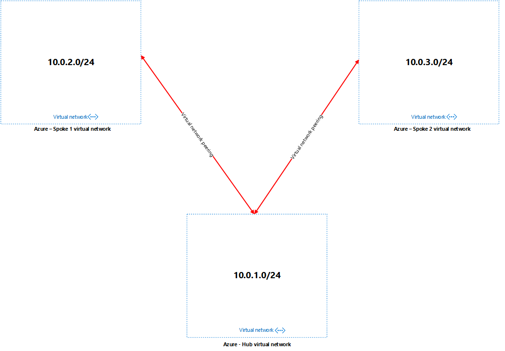

# Azure Networking Lab - Address Space Maintance with vNET Peering

## Introduction

This script dumps all vNET peering information with their relationship, also will export all information to a backup file, and you will set up the new address space on vNET with vNET peering connected from the vNET address space file.

## Requirements

- Install the powershell [Az modules](https://docs.microsoft.com/pt-br/powershell/azure/install-az-ps?view=azps-5.1.0) or use the [Azure Cloud Shell](https://docs.microsoft.com/en-us/azure/cloud-shell/overview) to run it.
- Ensure you are properly logged in to your tenant and with a subscription selected. You can check that by using:

```powershell
Add-AzAccount #Logon on your Azure Tenant
Get-AzContext # Check you have selected the correct Azure Subscription
Set-AzContext -Subscription <Subscription Name> # Set appropriate Subscription
```

## Known Issues

- After you establish a vNET peering is it not possible to change the address spaces inside Virtual Network without removing the vNET peering.

## Script
- Save the powershell script file (*azure-vnetpeering-addess-spacemaintenace.ps1*) in specific path and add the required parameters:
    - **$vnetname** = "Add Virtual Network Name"
    - **$rg** = "Add Resource Group Virtual Network"
    - **$exportPat** = "Add path to export the vNET Peering backup file"
    - **$addvnetPath** = "Inform path and file name with extesion to Add the address space inside vNET. For    example: c:\temp\vnet.txt"

Run the command:

```powershell
azure-vnetpeering-addess-spacemaintenace.ps1 -vnetname vNETName -rg ResourceGroup -exportPat FilePath -addvnetPath FullFilePath
```
## Lab
In this lab, you will setup two virtual networks in a hub-and-spoke design and configure a azure private peering between both vNETs. You will execute the powershell script to print the peering information, take a backup of all vNET information and add new address space into the hub vNET using a file with .txt extension. See the topology of this Lab environment:



Create the virtual networks using the Azure CLI in Azure Cloud Shell.

1. To start Azure Cloud Shell:

    - Select the Cloud Shell button on the menu bar at the upper right in the Azure portal. ->

    

2. Wait the windows apear and enter into the prompt with the following information:

```powershell
** Virtual Networks**
New-AzResourceGroup -Name lab-adressSpace-maintance-vnetpeering-rg -Location eastus2
$virtualNetwork01 = New-AzVirtualNetwork -ResourceGroupName lab-adressSpace-maintance-vnetpeering-rg -Location eastus2 -Name hub-vnet -AddressPrefix 10.0.1.0/24
$subnetConfig01 = Add-AzVirtualNetworkSubnetConfig -Name hubSubnet -AddressPrefix 10.0.1.0/24 -VirtualNetwork $virtualNetwork01
$virtualNetwork01 | Set-AzVirtualNetwork
$virtualNetwork02 = New-AzVirtualNetwork -ResourceGroupName lab-adressSpace-maintance-vnetpeering-rg -Location eastus2 -Name spoke1-vnet -AddressPrefix 10.0.2.0/24
$subnetConfig02 = Add-AzVirtualNetworkSubnetConfig -Name spoke1Subnet -AddressPrefix 10.0.2.0/24 -VirtualNetwork $virtualNetwork02
$virtualNetwork02 | Set-AzVirtualNetwork
$virtualNetwork03 = New-AzVirtualNetwork -ResourceGroupName lab-adressSpace-maintance-vnetpeering-rg -Location eastus2 -Name spoke2-vnet -AddressPrefix 10.0.3.0/24
$subnetConfig03 = Add-AzVirtualNetworkSubnetConfig -Name spoke2Subnet -AddressPrefix 10.0.3.0/24 -VirtualNetwork $virtualNetwork03
$virtualNetwork03 | Set-AzVirtualNetwork
```

```powershell
** vNET Peering**
Add-AzVirtualNetworkPeering -Name hubvnet-to-spoke1vnet -VirtualNetwork $virtualNetwork01 -RemoteVirtualNetworkId $virtualNetwork02.Id
Add-AzVirtualNetworkPeering -Name spoke1vnet-to-hubvnet -VirtualNetwork $virtualNetwork02 -RemoteVirtualNetworkId $virtualNetwork01.Id
Add-AzVirtualNetworkPeering -Name hubvnet-to-spoke2vnet -VirtualNetwork $virtualNetwork01 -RemoteVirtualNetworkId $virtualNetwork03.Id
Add-AzVirtualNetworkPeering -Name spoke2vnet-to-hubvnet -VirtualNetwork $virtualNetwork03 -RemoteVirtualNetworkId $virtualNetwork01.Id
```

3. Create a local file in C:\temp to add the new address space that you would like to insert in your virtual network. Run follow command on powershell:

```powershell
New-Item "c:\temp\add_new_address_space.txt" -ItemType File -Value "10.0.4.0/24"
```

4. Run the powershell script in your machine to get vNET peering information and add new address space inside of virtual network (hub-vnet). Run the following command:

```powershell
azure-vnetpeering-addess-spacemaintenace.ps1 -vnetname hub-vnet -rg lab-adressSpace-maintance-vnetpeering-rg -exportPat C:\temp -addvnetPath c:\temp\add_new_address_space.txt
```
## Contributing

Pull requests are welcome. For major changes. Please make sure to update tests as appropriate.
